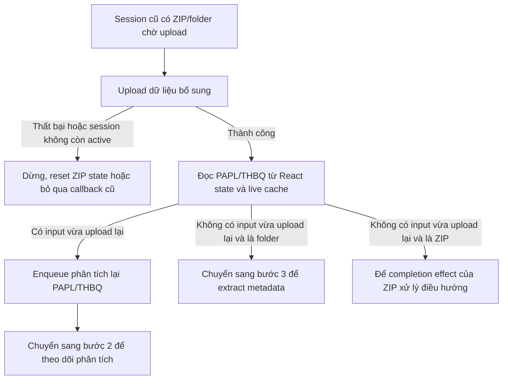
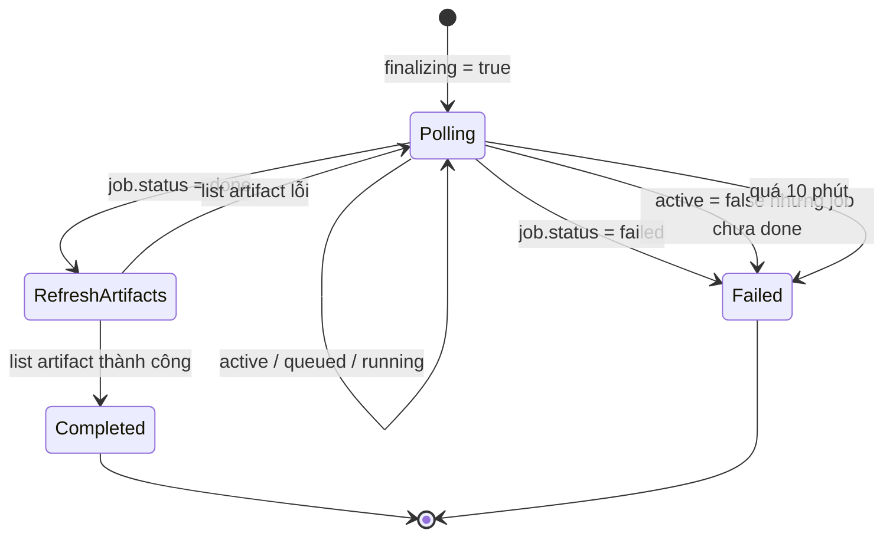

# Tổng hợp thay đổi frontend sau commit `9f6d760`

## 1. Phạm vi và cách đọc báo cáo

Báo cáo này phân tích repo frontend `ArchivalProcessing-FE`, trên nhánh hiện tại `poc`, với phạm vi Git:

```text
9f6d76047e2cd8014b286fe81e8544faed8c100d..d4084d4cc4b583b0c4bfbf7d9607e316d59c1271
```

Quy ước trên có nghĩa là:

- Commit `9f6d76047e2cd8014b286fe81e8544faed8c100d` được dùng làm mốc so sánh và **không tính vào phần thay đổi**.
- Báo cáo bao gồm tất cả commit đứng sau mốc trên đến `HEAD` hiện tại.
- Commit mốc có tiêu đề `feat: enable direct presigned uploads and folder uploads by default`, được tạo ngày 29/07/2026.
- `HEAD` khi phân tích là `d4084d4cc4b583b0c4bfbf7d9607e316d59c1271`, ngày 05/08/2026.

Các số liệu tổng quan:

| Chỉ tiêu | Giá trị |
| --- | ---: |
| Số commit sau commit mốc | 2 |
| Merge commit | 0 |
| Số file thay đổi | 14 |
| Dòng thêm | 451 |
| Dòng xóa | 131 |
| Tác giả của cả hai commit | `trunghieu1109` |

Phương pháp phân tích gồm: đọc lịch sử commit, đọc diff từng commit, đối chiếu code ở `HEAD`, lần theo các hàm gọi liên quan, đọc test mới và chạy lại test/typecheck/build ở trạng thái hiện tại.

## 2. Kết luận tổng quan

Hai commit tập trung vào hai nhóm chức năng lớn:

1. **Hoàn thiện luồng upload bổ sung cho session đã tồn tại**
   - Hiển thị đúng trạng thái đang upload và upload xong cho file DOCX.
   - Không bỏ sót việc phân tích lại phương án/thời hạn bảo quản khi upload DOCX và ZIP/folder xảy ra gần nhau.
   - Chống việc React state bị chậm hơn cache trong các callback bất đồng bộ.
   - Không tự động chuyển sang bước metadata nếu session vẫn còn đầu vào phương án cần phân tích lại.
   - Cho phép chuyển hàng loạt tài liệu đã chọn vào cả hồ sơ tạm/chờ xử lý.

2. **Nâng cấp theo dõi quá trình tạo mục lục/artifact**
   - Bổ sung API lấy trạng thái riêng của job `finalize_artifacts`.
   - Dùng trạng thái job làm nguồn sự thật thay vì suy luận hoàn tất từ ID artifact mới.
   - Hợp nhất việc polling tiến độ và polling kết quả vào một luồng.
   - Khôi phục theo dõi job đang chạy sau khi người dùng tải lại hoặc quay lại trang.
   - Hiển thị phase thất bại trực tiếp trên timeline và thẻ trạng thái.
   - Phân biệt rõ job `done`, `failed`, đang chạy, dừng bất thường, timeout và lỗi mạng tạm thời.

Về bản chất, đây không chỉ là bổ sung giao diện. Phần lớn thay đổi nhằm làm cho các workflow bất đồng bộ đáng tin cậy hơn trong các tình huống race condition, reload trang, job cũ/job mới và backend worker thất bại.

## 3. Danh sách commit

| Thứ tự | Commit | Thời gian | Nội dung chính | Thống kê |
| --- | --- | --- | --- | ---: |
| 1 | `73d66f97c26c6aa80a6742710f06485d8c50c7de` | 04/08/2026 22:13 +07:00 | Cải thiện state upload, phân tích lại PAPL/THBQ sau upload dữ liệu và thao tác chuyển tài liệu | 7 file, +113/-11 |
| 2 | `d4084d4cc4b583b0c4bfbf7d9607e316d59c1271` | 05/08/2026 00:14 +07:00 | Theo dõi trạng thái finalize artifact theo job, resume polling và hiển thị lỗi theo phase | 7 file, +338/-120 |

---

## 4. Commit `73d66f9`: hoàn thiện upload và phân tích lại phương án

### 4.1. Quản lý trạng thái upload DOCX chính xác hơn

File chính:

- [`src/features/upload/components/step1/DocxSection.tsx`](./src/features/upload/components/step1/DocxSection.tsx)
- [`src/pages/UploadPage.step1.tsx`](./src/pages/UploadPage.step1.tsx)

#### Vấn đề của luồng cũ

Ngay trước khi đọc/upload file, `DocxSection` đưa `processState` về `idle`. Vì vậy UI không thể hiện đúng rằng file đang được kiểm tra và gửi lên server. Trạng thái thành công cũng phụ thuộc vào callback bên ngoài tự cập nhật state, làm hành vi giữa tạo session mới và bổ sung session cũ không đồng nhất.

Nếu upload lỗi, component cũng không ghi nhớ trạng thái trước đó để khôi phục. Điều này đặc biệt quan trọng trong session cũ: người dùng có thể đang có một đầu vào hợp lệ, thử thay file mới nhưng upload thất bại; UI không nên làm mất trạng thái hợp lệ cũ một cách tùy ý.

#### Cách triển khai mới

`DocxSectionProps` có thêm prop tùy chọn:

```ts
uploadCompleteState?: ProcessState
```

Giá trị mặc định là `idle`, nhờ đó các nơi không truyền prop vẫn giữ hành vi tương thích.

Luồng xử lý hiện tại:

1. Lưu `processState` hiện tại vào `stateBeforeUpload`.
2. Đưa state sang `processing` ngay khi bắt đầu xử lý.
3. Đọc toàn bộ file và dùng `mammoth.convertToHtml` để xác thực khả năng đọc DOCX.
4. Với chế độ một file, gọi `onUploadFile`; với nhiều file, gọi `onUploadFiles` sau khi tất cả file đã qua bước đọc.
5. Nếu thành công, cập nhật trạng thái có file và chuyển sang `uploadCompleteState`.
6. Nếu thất bại:
   - Chế độ một file: xóa tên file vừa chọn và đặt `hasFile` về `false`.
   - Chế độ nhiều file: chỉ bỏ các tên file vừa thêm, giữ lại danh sách cũ.
   - Khôi phục `processState` về `stateBeforeUpload`.
7. Luôn tắt cờ loading trong `finally`.

`UploadPageStepOne` cấu hình trạng thái thành công theo ngữ cảnh:

| Ngữ cảnh | `uploadCompleteState` | Ý nghĩa |
| --- | --- | --- |
| Tạo session mới | `idle` | File mới chỉ được stage/chọn; bước xử lý chính chưa chạy |
| Bổ sung session đã tồn tại | `done` | Callback đã upload file trực tiếp vào session hiện có |

Thay đổi được áp dụng cho cả:

- Phương án phân loại/chỉnh lý (`arrangement_plan`).
- Một hoặc nhiều thông tư thời hạn bảo quản (`retention_schedule`).

Kết quả là badge “Đang xử lý” và “Xong” phản ánh đúng vòng đời upload, đồng thời các điều kiện khóa hành động dựa trên `doc1State`/`doc2State` nhận được trạng thái nhất quán hơn.

### 4.2. Chống race condition giữa React state và cache của workflow

File chính:

- [`src/pages/UploadPage.workflowPolicy.ts`](./src/pages/UploadPage.workflowPolicy.ts)
- [`src/pages/UploadPage.workflow.ts`](./src/pages/UploadPage.workflow.ts)
- [`src/pages/UploadPage.tsx`](./src/pages/UploadPage.tsx)

#### Bối cảnh kỹ thuật

Trang upload duy trì song song hai lớp trạng thái:

- React state như `planReuploadState` và biến suy ra `planInputsReuploaded`, dùng để render.
- `uploadPageCache`, được cập nhật ngay trong callback bất đồng bộ và tồn tại qua điều hướng.

Khi upload PAPL/THBQ hoàn tất gần thời điểm ZIP hoặc folder upload hoàn tất, cache có thể đã chuyển sang `true` nhưng render mới chưa xảy ra. Callback đang chạy có thể giữ giá trị React cũ trong closure. Hệ quả có thể là:

- Không nhận ra PAPL/THBQ vừa được upload lại.
- Bỏ qua bước phân tích lại phương án.
- Tự động điều hướng thẳng sang metadata quá sớm.
- Báo sai rằng người dùng chưa tải lại phương án hoặc thời hạn bảo quản.

#### Hai policy function mới

`resolvePlanInputsReuploaded` hợp nhất ba nguồn tín hiệu:

```ts
return renderedState || arrangementCached || retentionCached
```

Trong đó:

- `renderedState`: state đã có ở lần render hiện tại.
- `arrangementCached`: PAPL đã được upload lại theo live cache.
- `retentionCached`: THBQ đã được upload lại theo live cache.

`shouldAnalyzePlanInputsAfterDataUpload` chỉ cho phép phân tích khi cả hai điều kiện đều đúng:

```ts
return dataUploadSucceeded && planInputsReuploaded
```

Việc tách thành pure function làm rõ policy nghiệp vụ và cho phép unit test độc lập.

#### Không còn truyền `planReanalysisReady` đã tính sẵn từ render

Trước đây `UploadPage.tsx` tính:

```ts
existingSessionMode && planInputsReuploaded
```

rồi truyền kết quả vào `createUploadPageWorkflowActions`. Giá trị này có thể cũ tại thời điểm hàm async thực sự chạy.

Sau thay đổi, `handleReanalyzeExistingSessionPlan` tự xây dựng `currentPlanReuploadState` ngay lúc được gọi bằng phép OR giữa:

- `planReuploadState.arrangement` và `cache.arrangementPlanReuploaded`.
- `planReuploadState.retention` và `cache.retentionReuploaded`.

Từ snapshot mới nhất đó, hàm xác định:

- Có đủ điều kiện phân tích lại hay không.
- Có cần phân tích PAPL hay không.
- Có cần phân tích THBQ hay không.
- Có phải trường hợp chỉ phân tích THBQ (`retentionOnly`) hay không.
- Đường dẫn file nào phải gửi cho `enqueuePlanAnalysis`.

Nếu session chưa có phương án sẵn sàng nhưng đã có input lưu trước đó, nhánh `analyzeStoredInputs` vẫn cho phép phân tích từ dữ liệu đang có. Các kiểm tra đường dẫn local của backend vẫn được giữ nguyên trước khi enqueue job.

#### Tự động phân tích PAPL/THBQ sau khi upload dữ liệu bổ sung

Trong `handleStartAllImpl`, nhánh session cũ có ZIP hoặc folder đang chờ upload được đổi như sau:

1. Bảo đảm có session bằng `ensureSession()`.
2. Gọi `uploadPendingDataInput(currentSessionId)`.
3. Chỉ coi là thành công khi có response và session hiện tại vẫn là active view.
4. Xác định dữ liệu là folder hay ZIP.
5. Đọc lại trạng thái PAPL/THBQ từ cả render state lẫn live cache.
6. Nếu dữ liệu upload thành công **và** có PAPL/THBQ vừa upload lại, gọi `handleReanalyzeExistingSessionPlan()` ngay.
7. Nếu không có đầu vào phương án cần phân tích và dữ liệu là folder, chuyển sang bước metadata (`step/3?extract=1`).
8. Nếu lỗi upload, đưa ZIP state về `idle` và hiển thị toast lỗi như trước.

Luồng quyết định chính:



#### Chặn auto-navigation sai khi ZIP hoàn tất

Effect theo dõi `currentZipUploadJob` trước đây có thể tự chuyển sang metadata ngay khi ZIP hoàn tất. Nay điều kiện guard gọi `resolvePlanInputsReuploaded` trực tiếp với các cờ cache hiện thời.

Nếu `arrangementPlanReuploaded` hoặc `retentionReuploaded` đang là `true`, effect dừng lại, không gọi `navigate(step/3)`. Workflow có cơ hội enqueue phân tích lại phương án trước.

Đây là lớp bảo vệ thứ hai bên cạnh `handleStartAllImpl`: một lớp xử lý luồng do CTA khởi động, lớp còn lại bảo vệ callback hoàn tất của upload manager.

### 4.3. Cho phép chuyển tài liệu đã chọn vào hồ sơ tạm/chờ xử lý

File:

- [`src/features/upload/components/step4/FinalResult.resultNode.tsx`](./src/features/upload/components/step4/FinalResult.resultNode.tsx)

Điều kiện render nút chuyển hàng loạt trước đây loại trừ node `pending_dossier` bằng `!isPendingDossier`.

Commit đã bỏ điều kiện loại trừ này. Vì `pending_dossier` vốn đã được xem là một `isDossier` và `isDropFolder`, nút “Chuyển tới hồ sơ này” nay xuất hiện khi:

- Node là dossier, pending dossier hoặc thư mục tạm.
- Node có `group`.
- Có ít nhất một tài liệu đang được chọn.

Nút vẫn dùng chung toàn bộ cơ chế hiện có:

- `selectedDocumentsActionDisabled` để khóa khi không thể thao tác.
- Spinner theo `movingSelectedDocumentsTargetId`.
- `onMoveSelectionToDossier(group)` để thực hiện chuyển.
- `stopPropagation()` để không làm đóng/mở node khi bấm nút.

Thay đổi này làm thao tác bulk move đồng nhất với khả năng drag-and-drop vốn đã coi pending dossier là một drop target.

### 4.4. Test được bổ sung cho workflow upload

File:

- [`tests/uploadPageWorkflowPolicy.test.mjs`](./tests/uploadPageWorkflowPolicy.test.mjs)

Ba test case mới kiểm tra:

1. Upload ZIP bổ sung thành công và có THBQ vừa upload lại thì phải phân tích đầu vào phương án.
2. React state vẫn `false` nhưng live cache của THBQ đã `true` thì phải nhận ra input vừa upload lại.
3. Không phân tích nếu chỉ upload ZIP, hoặc upload dữ liệu thất bại dù có cờ reupload.

Các test này tập trung vào policy thuần, không phụ thuộc React DOM hay API thật.

---

## 5. Commit `d4084d4`: theo dõi job tạo mục lục theo trạng thái backend

### 5.1. Bổ sung API contract cho finalize status

File chính:

- [`src/features/upload/api/sessionApi.artifacts.ts`](./src/features/upload/api/sessionApi.artifacts.ts)
- [`src/features/upload/api/sessionApi.documentTypes.ts`](./src/features/upload/api/sessionApi.documentTypes.ts)

API client mới:

```http
GET /sessions/{sessionId}/artifacts/finalize/status
```

Hàm frontend:

```ts
getFinalizeArtifactsStatus(sessionId): Promise<FinalizeArtifactStatusResponse>
```

`sessionId` được encode trước khi ghép URL và request dùng cơ chế `requestJson` chung của ứng dụng.

Ba interface mới mô hình hóa response:

#### `FinalizeArtifactProgress`

| Trường | Vai trò |
| --- | --- |
| `event_id` | ID event tiến độ gần nhất |
| `job_id` | Job tạo artifact mà tiến độ thuộc về |
| `phase` | Phase backend hiện tại |
| `message`, `created_at` | Thông báo và thời gian tùy chọn |
| `dossier_count`, `placement_count`, `artifact_count` | Các bộ đếm tùy chọn |
| `run_id` | ID lần chạy artifact tùy chọn |
| `summary` | Payload tổng hợp mở rộng |

#### `FinalizeArtifactResult`

| Trường | Vai trò |
| --- | --- |
| `event_id`, `job_id` | Liên kết kết quả với event/job |
| `run_id`, `output_dir` | Thông tin lần chạy và thư mục đầu ra |
| `artifact_count` | Số artifact sinh ra |
| `summary` | Tổng hợp kết quả mở rộng |
| `source_fingerprint` | Dấu vân tay dữ liệu nguồn |
| `message`, `created_at` | Thông báo và thời gian kết quả |

#### `FinalizeArtifactStatusResponse`

Response kế thừa `ApiRevisionMetadata` và chứa:

- `session_id`.
- `job_type` cố định là `finalize_artifacts`.
- `active`: backend xác nhận job còn hoạt động hay không.
- `job`: `ActiveJobSummary` hoặc `null`.
- `progress`: tiến độ gần nhất hoặc `null`.
- `result`: kết quả gần nhất hoặc `null`.

Trong UI hiện tại, `job` và `progress` được dùng trực tiếp để điều khiển state; `result` đã được khai báo sẵn trong contract nhưng chưa được dùng để render chi tiết.

Một số thay đổi còn lại trong `sessionApi.artifacts.ts` chỉ là format lại type của style numbering và lời gọi `requestJson`, không thay đổi hành vi.

### 5.2. Thay nguồn sự thật của quá trình finalize

File chính:

- [`src/pages/FinalizeArtifactsPage.tsx`](./src/pages/FinalizeArtifactsPage.tsx)

#### Cơ chế cũ

Trang trước đây chạy hai polling loop độc lập:

1. Poll danh sách artifact và coi job hoàn tất khi có artifact có `id` lớn hơn `maxArtifactId` ghi nhận trước lúc dispatch.
2. Poll toàn bộ session event qua `listSessionEvents`, tự lọc `artifacts.finalize.progress` và `artifacts.item.ready` để dựng timeline.

Các hạn chế của cách cũ:

- “Có ID artifact mới” chỉ là dấu hiệu gián tiếp, không phải trạng thái job.
- Khó xử lý trường hợp backend cập nhật/tái sinh artifact nhưng không tạo ID theo kỳ vọng của UI.
- Hai vòng polling có thể cập nhật các phần state khác nhau tại thời điểm khác nhau.
- Event được đọc theo session, trong khi UI cần biết tiến độ thuộc đúng finalize job nào.
- Không có nhánh rõ ràng cho job `failed`.
- Khi reload trang, local state `finalizing` bị mất nên UI không tự tiếp tục theo dõi job đang chạy.

#### Cơ chế mới

Trang dùng `getFinalizeArtifactsStatus` làm nguồn sự thật cho cả tiến độ và trạng thái terminal của job. Hai polling effect cũ được hợp nhất thành một effect duy nhất.

Các phần đã loại bỏ:

- State `pollAfterArtifactId`.
- Utility `maxArtifactId`.
- Import và polling `listSessionEvents`.
- Hằng polling event cục bộ riêng.
- Tiêu chí hoàn tất dựa trên `artifact.id > pollAfterArtifactId`.

Tiêu chí hoàn tất mới là `status.job.status === "done"` từ backend.

### 5.3. Luồng bắt đầu finalize

`startFinalize` thực hiện các bước sau:

1. Nếu không có `sessionId`, dừng và hiển thị lỗi.
2. Đặt `finalizing = true`, xóa cờ thất bại/failed phase và lỗi cũ.
3. Refresh danh sách artifact hiện có ở chế độ silent.
4. Gọi `enqueueFinalizeArtifacts` với:
   - `created_by: "ui"`.
   - `metadata_export_mode: "combined"`.
   - `force` theo nguồn gọi.
5. Lưu `dispatch.job_id` vào `activeFinalizeJobIdRef`.

Hai nguồn gọi giữ hành vi khác nhau:

- Auto-start gọi với `force: false`.
- Người dùng bấm “Tạo mục lục”/“Tạo lại” gọi với `force: true`.

Xử lý từng dispatch status:

| Dispatch status | Xử lý frontend |
| --- | --- |
| `not_needed` | Dừng polling, xóa job ref, đánh dấu toàn bộ phase hoàn tất, giữ artifact hiện có và thông báo không cần tạo lại |
| `already_queued_or_running` | Giữ `finalizing`, hiển thị thông báo job đã chạy và bắt đầu/tiếp tục polling |
| `queued` | Giữ `finalizing`, hiển thị toast đã gửi yêu cầu và bắt đầu polling |
| Request lỗi | Xóa job ref, đặt `finalizeFailed`, dừng loading/finalizing, hiển thị error và toast |

### 5.4. Theo dõi đúng job và bỏ qua status cũ

`activeFinalizeJobIdRef` lưu ID job frontend đang chờ. Ref được dùng vì polling callback cần đọc/ghi giá trị mới nhất mà không chờ render.

Mỗi lần nhận status:

1. Lấy `expectedJobId` từ ref.
2. Nếu backend trả về một job có ID nhỏ hơn job đang chờ, coi đó là snapshot cũ.
3. Không cập nhật timeline từ snapshot cũ; chỉ lên lịch poll tiếp theo.
4. Khi nhận job hợp lệ, cập nhật ref bằng ID backend trả về.

Cơ chế này dựa trên giả định ID job tăng dần và ngăn response của job trước làm UI kết luận sai về job vừa enqueue.

### 5.5. State machine polling mới

Polling bắt đầu ngay lập tức khi `finalizing` chuyển sang `true`, sau đó lặp theo `FINALIZE_POLL_INTERVAL_MS = 5.000 ms`. Delay đi qua `visibleAwareDelay`, nên vẫn dùng chính sách chung của ứng dụng đối với trạng thái hiển thị của tab. Timeout tổng là 10 phút.



Chi tiết từng nhánh:

- **Timeout:** gọi `stopWithFailure`, xóa job ref, tắt finalizing, lưu lỗi, cập nhật thông báo và hiện toast.
- **Status request lỗi tạm thời:** không kết luận job lỗi; tiếp tục poll cho đến timeout.
- **Job failed:** ưu tiên `status.job.error`; giữ lại failed phase hiện tại nếu backend đã cung cấp phase.
- **Job done:** refresh artifact một lần nữa. Chỉ sau khi list artifact thành công mới chuyển UI sang hoàn tất.
- **List artifact lỗi sau khi job done:** `refreshArtifacts` trả `null`, polling tiếp tục thay vì kết luận sai.
- **List artifact thành công nhưng rỗng:** vẫn chấp nhận trạng thái job `done` là nguồn sự thật và hiển thị số file thực tế là 0.
- **`active = false` nhưng job không `done`/`failed`:** coi là dừng bất thường và hiển thị trạng thái job trong thông báo lỗi.
- **Chưa có progress:** hiển thị thông báo chờ backend chuẩn bị hoặc ghi nhận job, rồi tiếp tục poll.
- **Cleanup:** khi component/effect bị hủy, đặt cờ `cancelled` và clear timeout để tránh cập nhật state sau unmount.

### 5.6. Phân biệt lỗi tải danh sách với danh sách hợp lệ nhưng rỗng

`refreshArtifacts` trước đây trả `[]` cả khi không có artifact lẫn khi request thất bại. Nay:

- Request thành công, không có artifact: trả `[]`.
- Request thất bại: trả `null`.

Sự khác biệt này cho phép polling biết rằng job đã `done` nhưng frontend chưa tải được kết quả, từ đó retry thay vì dừng với danh sách rỗng do lỗi mạng.

Khi bắt đầu finalize, kết quả `null` vẫn được chuyển thành `[]` để nhánh `not_needed` có thể tạo thông báo an toàn.

### 5.7. Khôi phục job sau reload/quay lại trang

Khi `autoStart = false` và có `sessionId`, trang thực hiện best-effort status check một lần lúc mount:

```ts
getFinalizeArtifactsStatus(sessionId)
```

Nếu backend báo job đang active:

- Lưu job ID vào ref.
- Xóa trạng thái lỗi cũ.
- Áp dụng progress/phase hiện tại.
- Đặt `finalizing = true` để kích hoạt polling định kỳ.

Nếu job gần nhất failed:

- Áp dụng phase và các phase đã hoàn tất.
- Đặt `finalizeFailed = true`.
- Hiển thị `job.error` hoặc fallback message.

Nếu status check ban đầu lỗi, exception bị bỏ qua có chủ đích để danh sách artifact và các chức năng xem/tải file vẫn sử dụng được. Đây là cơ chế resume “best effort”, không làm hỏng toàn trang khi endpoint status tạm thời không sẵn sàng.

Với `autoStart = true`, effect resume và effect refresh thông thường được bỏ qua; `startFinalize({ force: false })` là luồng chịu trách nhiệm khởi tạo trạng thái.

### 5.8. Chuẩn hóa ánh xạ phase backend sang timeline

File:

- [`src/pages/FinalizeArtifactsPage.utils.ts`](./src/pages/FinalizeArtifactsPage.utils.ts)

Pure function mới `buildFinalizeProgressViewState(phase, jobStatus)` trả về:

- `activePhase`.
- `failedPhase`.
- `completedPhases`.

Bốn phase finalize hiện có:

| Thứ tự | Phase ID | Nhãn UI |
| ---: | --- | --- |
| 1 | `loading_data` | Tổng hợp dữ liệu hồ sơ |
| 2 | `creating_xlsx` | Tạo các file Excel |
| 3 | `writing_manifest` | Ghi danh sách tệp |
| 4 | `completed` | Hoàn tất |

Quy tắc ánh xạ:

| Trạng thái | `activePhase` | `failedPhase` | Phase hoàn tất |
| --- | --- | --- | --- |
| Đang chạy ở phase hợp lệ | Phase hiện tại | `null` | Tất cả phase đứng trước |
| `jobStatus = done` hoặc phase `completed` | `null` | `null` | Toàn bộ phase |
| `jobStatus = failed` ở phase hợp lệ | `null` | Phase hiện tại | Tất cả phase đứng trước |
| Phase rỗng/không nhận diện | `null` | `null` | Không tự suy diễn |

`applyFinalizeStatus` còn bổ sung fallback phase:

- Job `done` nhưng progress không có phase: dùng `completed`.
- Job active nhưng chưa có progress: dùng `loading_data`.
- Nếu progress có message, đồng bộ message đó vào cả timeline và status card.

Việc gom logic này vào utility tránh để từng effect tự cộng dồn phase theo cách khác nhau.

### 5.9. Timeline hỗ trợ phase thất bại

File:

- [`src/features/upload/components/ProgressTimeline.tsx`](./src/features/upload/components/ProgressTimeline.tsx)

Component dùng chung `ProgressTimeline` có thêm prop tùy chọn:

```ts
failedPhase?: string | null
```

Khi một phase là failed phase:

- Icon bị thay bằng `CircleAlert`.
- Viền, nền, chữ và connector chuyển sang tông đỏ.
- Phase đó không còn được coi là active nên không hiển thị spinner.
- Các phase trước vẫn có thể hiển thị màu xanh hoàn tất.

Prop là optional nên các timeline khác của ứng dụng không cần sửa và vẫn giữ hành vi cũ.

### 5.10. Status card phân biệt trạng thái thất bại

File:

- [`src/pages/FinalizeArtifactsPage.parts.tsx`](./src/pages/FinalizeArtifactsPage.parts.tsx)

`FinalizeStatusCard` nhận thêm `finalizeFailed`:

- Đang chạy: spinner màu xanh dương.
- Thất bại: icon `AlertCircle`, nền/chữ đỏ.
- Không chạy và không thất bại: `CheckCircle2`, nền/chữ xanh lá.

Trang finalize đồng thời vẫn hiển thị error banner chi tiết bên dưới status card và toast trong các lỗi phát sinh khi polling/dispatch.

### 5.11. Test mới cho progress mapping

File mới:

- [`tests/finalizeArtifactsProgress.test.mjs`](./tests/finalizeArtifactsProgress.test.mjs)

Ba test case kiểm tra:

1. Đang chạy tại `writing_manifest`: `loading_data` và `creating_xlsx` hoàn tất; `writing_manifest` active.
2. Job done ở `completed`: toàn bộ phase hoàn tất, không có active/failed phase.
3. Job failed tại `writing_manifest`: hai phase trước hoàn tất và đúng phase cuối được đánh dấu failed.

---

## 6. Ảnh hưởng tổng hợp đến trải nghiệm người dùng

### 6.1. Session cũ có upload lại PAPL/THBQ

Trước thay đổi, người dùng có thể thấy file đã upload nhưng luồng tiếp theo bỏ qua phân tích lại do state render chưa kịp cập nhật. Sau thay đổi:

- File thể hiện “Đang xử lý” trong thời gian upload.
- Thành công thể hiện “Xong”.
- Cache được dùng như nguồn trạng thái tức thời trong async callback.
- ZIP/folder hoàn tất không được phép kéo người dùng sang metadata nếu PAPL/THBQ vẫn cần phân tích.
- Sau khi dữ liệu bổ sung thành công, job phân tích được enqueue và người dùng được đưa sang bước theo dõi phân tích.

### 6.2. Tạo/tạo lại mục lục

Trước thay đổi, UI suy luận hoàn tất từ artifact mới và đọc event rời rạc. Sau thay đổi:

- Backend job status quyết định kết quả.
- Timeline phản ánh đúng phase hiện tại của đúng job hơn.
- Reload trang không làm mất khả năng theo dõi job đang chạy.
- Worker failure được hiển thị rõ thay vì chờ đến timeout.
- Lỗi mạng tạm thời không lập tức biến thành lỗi nghiệp vụ.
- Job done nhưng tải danh sách artifact lỗi sẽ được retry.

### 6.3. Sắp xếp hồ sơ

Người dùng có thể dùng nút bulk move để chuyển tài liệu đã chọn vào pending dossier, không còn bắt buộc drag-and-drop từng tài liệu hoặc chỉ chuyển vào dossier đã hoàn chỉnh.

## 7. Ma trận file thay đổi

| File | Commit | +/- | Vai trò thay đổi |
| --- | --- | ---: | --- |
| `src/features/upload/components/step1/DocxSection.tsx` | `73d66f9` | +6/-1 | State machine cho upload DOCX, success state tùy ngữ cảnh, rollback khi lỗi |
| `src/features/upload/components/step4/FinalResult.resultNode.tsx` | `73d66f9` | +0/-1 | Cho phép bulk move vào pending dossier |
| `src/pages/UploadPage.step1.tsx` | `73d66f9` | +2/-0 | Truyền `done` cho upload trực tiếp trong session cũ |
| `src/pages/UploadPage.tsx` | `73d66f9` | +6/-2 | Guard auto-navigation bằng live cache; bỏ prop reanalysis tính sẵn |
| `src/pages/UploadPage.workflow.ts` | `73d66f9` | +37/-7 | Recompute trạng thái reupload và phân tích PAPL/THBQ sau data upload |
| `src/pages/UploadPage.workflowPolicy.ts` | `73d66f9` | +22/-0 | Hai pure policy function mới |
| `tests/uploadPageWorkflowPolicy.test.mjs` | `73d66f9` | +40/-0 | Test race/cache và điều kiện phân tích sau data upload |
| `src/features/upload/api/sessionApi.artifacts.ts` | `d4084d4` | +24/-10 | API GET finalize status; một phần thay đổi là format code |
| `src/features/upload/api/sessionApi.documentTypes.ts` | `d4084d4` | +34/-0 | Type progress/result/status cho finalize |
| `src/features/upload/components/ProgressTimeline.tsx` | `d4084d4` | +27/-13 | Hiển thị failed phase bằng icon và màu đỏ |
| `src/pages/FinalizeArtifactsPage.parts.tsx` | `d4084d4` | +8/-1 | Status card có trạng thái thất bại |
| `src/pages/FinalizeArtifactsPage.tsx` | `d4084d4` | +168/-91 | Poll theo job status, resume, stale-job guard, failure handling |
| `src/pages/FinalizeArtifactsPage.utils.ts` | `d4084d4` | +37/-5 | Pure phase mapper; bỏ `maxArtifactId` |
| `tests/finalizeArtifactsProgress.test.mjs` | `d4084d4` | +40/-0 | Test active/done/failed progress mapping |

## 8. Thay đổi kiến trúc và nguyên tắc triển khai đáng chú ý

### 8.1. Tách policy khỏi orchestration

Các điều kiện boolean dễ gây lỗi được đưa vào pure function trong `UploadPage.workflowPolicy.ts`. Điều này giảm độ phức tạp của orchestration và cho phép test trực tiếp các tổ hợp state.

### 8.2. Cache là nguồn tức thời, React state là nguồn render

Workflow upload không thay hoàn toàn React state bằng cache. Thay vào đó, ở các điểm bất đồng bộ nhạy cảm, code hợp nhất cả hai để tránh stale closure. UI vẫn render từ state, còn quyết định nghiệp vụ có thể đọc live cache.

### 8.3. Trạng thái backend thay thế heuristic frontend

Finalize không còn dùng “có record mới” làm bằng chứng job hoàn tất. Endpoint status chuyên biệt cung cấp job/progress/result và frontend chỉ tải artifact sau khi backend xác nhận `done`.

### 8.4. Dùng ref để tương quan job

`activeFinalizeJobIdRef` không tham gia render nhưng giữ job ID mới nhất cho callback polling. Cách này tránh phải thêm job ID vào dependency và tránh closure giữ ID cũ.

### 8.5. Một polling loop cho một state machine

Tiến độ, lỗi và completion đều đến từ một snapshot status, giảm nguy cơ hai effect độc lập cập nhật chồng chéo. Danh sách artifact chỉ còn là dữ liệu đầu ra tải sau khi job hoàn tất, không phải nguồn trạng thái job.

## 9. Kiểm thử và xác minh tại `HEAD`

Các lệnh đã chạy trực tiếp trên `d4084d4`:

| Kiểm tra | Kết quả |
| --- | --- |
| `npm.cmd test` | Đạt: 28/28 test, 0 fail |
| `npm.cmd run typecheck` | Đạt |
| `npm.cmd run build` | Đạt; Vite transform 2.765 module |
| `npm.cmd run lint` | Không đạt: 80 error, 8 warning trên toàn repo |

Chi tiết liên quan trực tiếp đến hai commit:

- 3 test finalize progress mới đều đạt.
- 3 test workflow upload mới đều đạt; test cuối chứa hai assertion cho hai nhánh âm.
- TypeScript chấp nhận toàn bộ API type, prop và state mới.
- Production build hoàn tất.
- Build cảnh báo bundle JavaScript chính khoảng 3.481 kB trước gzip, vượt ngưỡng cảnh báo chunk 500 kB. Đây không phải lỗi build và không nằm trong phạm vi hai commit.

Lint toàn repo hiện chưa xanh. Kết quả lint chỉ phản ánh trạng thái `HEAD`, không đủ để quy toàn bộ 80 lỗi cho hai commit. Các nhóm lỗi gồm rule React hooks/compiler, `no-explicit-any`, fast-refresh export và một số warning dependency. Báo cáo này không sửa các lỗi lint vì yêu cầu hiện tại là phân tích lịch sử thay đổi.

## 10. Các điểm cần lưu ý khi bảo trì hoặc kiểm thử tiếp

### 10.1. Coverage mới chủ yếu ở tầng pure function

Test mới xác minh rất tốt policy boolean và phase mapping, nhưng chưa có integration test cho:

- Upload DOCX thực tế và rollback UI khi API lỗi.
- ZIP/folder upload chạy đồng thời với PAPL/THBQ.
- `handleStartAllImpl` thực sự enqueue đúng payload.
- Resume finalize sau reload.
- Bỏ qua status job cũ.
- Retry khi endpoint status hoặc list artifact lỗi.
- Timeout 10 phút và cleanup timer.

Đây là các ca nên ưu tiên nếu bổ sung React/integration/E2E test.

### 10.2. Stale-job guard giả định ID job tăng dần

Điều kiện hiện tại bỏ qua status khi `status.job.id < expectedJobId`. Nếu backend thay đổi cách cấp ID hoặc status endpoint có thể trả một job khác có ID lớn hơn nhưng không phải job mong đợi, frontend sẽ chấp nhận job đó. Contract hiện tại dường như dựa vào ID số tăng dần.

### 10.3. Unknown phase không được tự suy diễn

Nếu backend thêm phase mới nhưng frontend chưa cập nhật `FINALIZE_PROGRESS_PHASES`, helper sẽ không đánh dấu active/failed phase. Message backend vẫn có thể hiển thị, nhưng timeline không tô phase mới. Khi mở rộng worker, cần cập nhật danh sách phase và test tương ứng.

### 10.4. `result` đã có type nhưng chưa được dùng

`FinalizeArtifactResult` cung cấp `artifact_count`, `run_id`, `output_dir`, fingerprint và summary, nhưng UI hiện vẫn lấy số file từ `listArtifacts`. Có thể tận dụng `result` sau này để đối chiếu số artifact mong đợi hoặc hiển thị thông tin lần chạy.

### 10.5. Hành vi khi tạo lại thất bại nhưng artifact cũ vẫn tồn tại

Nếu một lần “Tạo lại” thất bại nhưng session vẫn có artifact cũ:

- Timeline/error banner và icon status card thể hiện lần chạy mới thất bại.
- Badge của status card vẫn có thể ghi “Sẵn sàng” vì badge dựa trên số artifact hiện có.
- Nút “Xuất bản” trong embedded mode vẫn có thể xuất hiện vì điều kiện là có artifact và không còn `finalizing`; điều kiện không kiểm tra `finalizeFailed`.

Đây có thể là chủ đích để vẫn dùng được artifact cũ, nhưng sản phẩm cần thống nhất rõ artifact cũ có được phép xuất bản sau một lần regenerate thất bại hay không.

### 10.6. Lỗi status tạm thời chỉ lộ ra khi timeout

Trong polling, lỗi request status được retry im lặng. Cách này chống nhiễu tốt với lỗi mạng ngắn hạn, nhưng người dùng chỉ nhận thông báo khi quá timeout 10 phút. Nếu cần quan sát tốt hơn, có thể thêm bộ đếm lỗi liên tiếp hoặc trạng thái “mất kết nối, đang thử lại”.

### 10.7. Không có thay đổi dependency hoặc route

Hai commit không sửa `package.json`, không thêm dependency mới, không đổi route và không tạo page mới. Chúng mở rộng các component/page/API client hiện có. Endpoint finalize status là dependency backend mới duy nhất mà frontend bắt đầu gọi.

## 11. Tóm tắt theo loại thay đổi

### Tính năng mới

- Theo dõi trạng thái riêng của job finalize artifact.
- Resume job finalize đang chạy khi mở lại trang.
- Hiển thị phase thất bại trên timeline.
- Hiển thị status card màu đỏ khi finalize lỗi.
- Tự động phân tích lại PAPL/THBQ sau upload ZIP/folder bổ sung khi cần.
- Bulk move tài liệu vào pending dossier.

### Bug fix và cải thiện độ ổn định

- Sửa trạng thái DOCX không hiển thị `processing` trong lúc upload.
- Khôi phục state trước upload khi upload DOCX thất bại.
- Sửa race giữa React render state và `uploadPageCache`.
- Ngăn auto-navigation sang metadata khi vẫn có PAPL/THBQ cần phân tích.
- Không còn kết luận finalize dựa vào ID artifact mới.
- Nhận diện và hiển thị job `failed` ngay khi backend báo lỗi.
- Bỏ qua status thuộc job cũ hơn job vừa enqueue.
- Retry list artifact nếu job đã done nhưng request danh sách lỗi.
- Dọn timer/callback polling khi effect bị hủy.

### Cải thiện khả năng kiểm thử và bảo trì

- Tách hai upload workflow policy thành pure function.
- Tách progress-to-view-state thành pure function.
- Bổ sung 6 test case liên quan trực tiếp đến hai nhóm thay đổi.
- Hợp nhất hai polling loop finalize thành một state machine rõ ràng hơn.

## 12. Kết luận cuối

Từ sau `9f6d760` đến `d4084d4`, frontend được nâng cấp chủ yếu ở độ tin cậy của hai workflow bất đồng bộ quan trọng: bổ sung dữ liệu/phân tích lại phương án và tạo bộ mục lục. Các thay đổi giải quyết những lỗi khó thấy trong luồng bình thường nhưng dễ xảy ra khi upload đồng thời, state cập nhật lệch nhịp, reload trang, worker lỗi hoặc backend trả trạng thái của job cũ.

Trạng thái hiện tại đã vượt qua toàn bộ test, typecheck và production build. Phần cần theo dõi tiếp là integration/E2E coverage cho orchestration bất đồng bộ, quy ước sử dụng artifact cũ sau khi regenerate thất bại, khả năng mở rộng phase backend và lượng lint debt hiện có của toàn repo.
